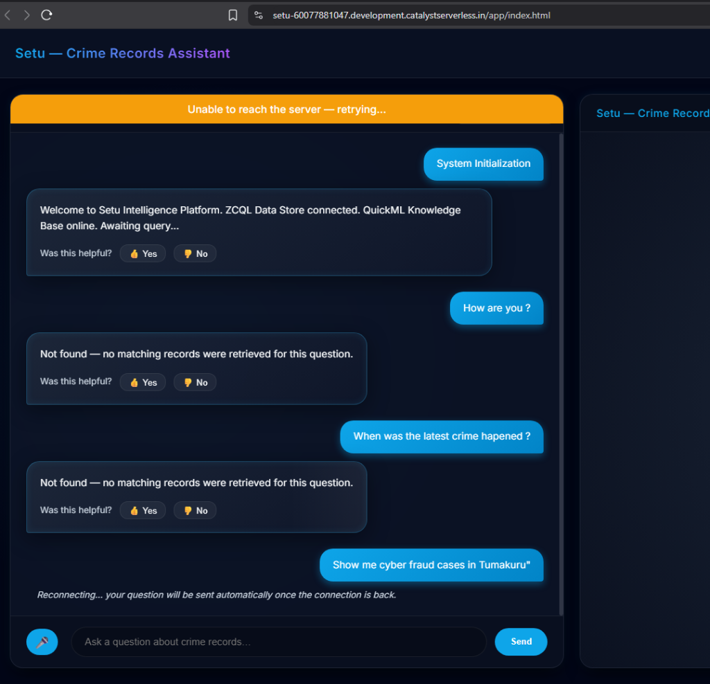
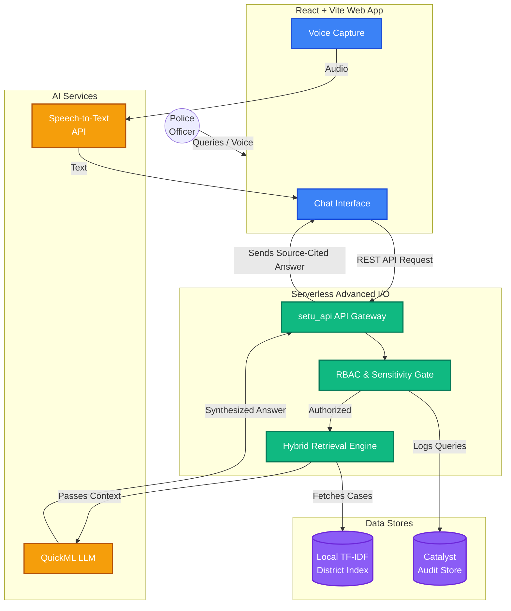
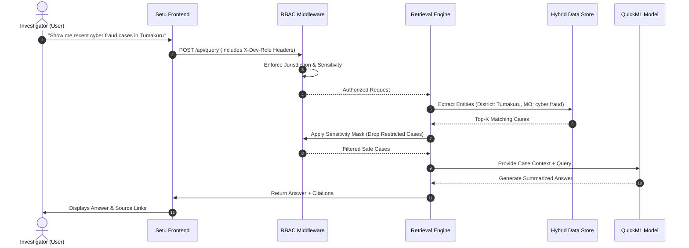

<div align="center">
  <h1>🛡️ Setu — Crime Records Assistant</h1>
  <p><i>Intelligent Conversational AI for the Karnataka State Police Crime Database</i></p>
</div>

---



## 📖 What is Setu?

**Setu** is a bilingual (Kannada + English), voice-enabled conversational AI that empowers Karnataka Police investigators to query crime records in plain language. It provides source-cited, explainable answers, visualizes criminal networks, and delivers proactive crime-pattern early warnings. 

Built natively on **Zoho Catalyst**, Setu ensures all data is grounded in actual case evidence rather than demographic profiling, strictly adhering to role-based access control (RBAC).

## 🏗️ System Architecture

Our solution uses a serverless Catalyst Functions layer to orchestrate a hybrid RAG pipeline (structured ZCQL + District-partitioned semantic search), a QuickML LLM summarizer, and a tamper-evident audit store.



## 🔄 User Journey & Data Flow

How does a typical query propagate through the system? 



## ✨ Key Features

- 🗣️ **Bilingual Queries**: Query naturally in Kannada or English using text or voice.
- 📑 **Explainable AI**: RAG-grounded answers with explicit, clickable source case citations.
- 🔐 **Secure & Tamper-Evident**: Strict Role-Based Access Control (RBAC) and immutable hash-chained query audit logs.
- ⚡ **High Performance**: Highly scalable hybrid retrieval utilizing on-the-fly **District-Level Index Partitioning** (measured sub-100ms at 50x load).
- 🕸️ **Advanced Analytics**: Interactive criminal network visualization and early-warning alerts.

## 💻 Tech Stack

- **Frontend**: React, TypeScript, Vite, D3.js
- **Backend**: Python 3.10+ (Catalyst Advanced I/O Functions)
- **Retrieval**: TF-IDF + BM25, Local NLP Heuristics
- **Cloud Platform**: Zoho Catalyst (Data Store, QuickML, Caching)

## 🚀 Setup & Installation

**1. Clone the repo**
```bash
git clone https://github.com/<org>/setu-ksp-datathon.git
cd setu-ksp-datathon
```

**2. Setup Zoho Catalyst CLI**
```bash
npm install -g zcatalyst-cli
catalyst login
catalyst init
```

**3. Install Dependencies**
```bash
# Frontend
cd client && npm install

# Backend
cd ../functions/setu_api && pip install -r requirements.txt --break-system-packages
```

**4. Run Locally**
```bash
# Serve functions locally via Catalyst CLI
catalyst serve

# In a separate terminal, run the frontend
cd client && npm run dev
```

## ⚖️ Responsible AI

Setu's predictive and pattern-detection features are deliberately grounded in **modus-operandi and case-level evidence only**. We strictly prohibit demographic, caste, religion, or socio-economic profiling. This restriction is enforced directly at the data-schema level, ensuring ethical and responsible AI usage by the police force.

## 🗄️ Documentation

The complete planning and design process — including hackathon analysis, architecture blueprints, engineering plans, and deployment strategies — can be found in the [`docs/`](./docs) directory.

---
<div align="center">
  <p>Built for the <b>Karnataka State Police Datathon 2026</b></p>
</div>
