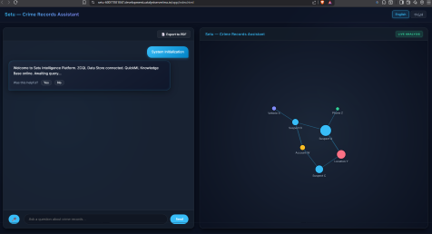
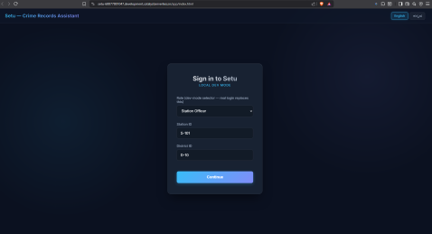
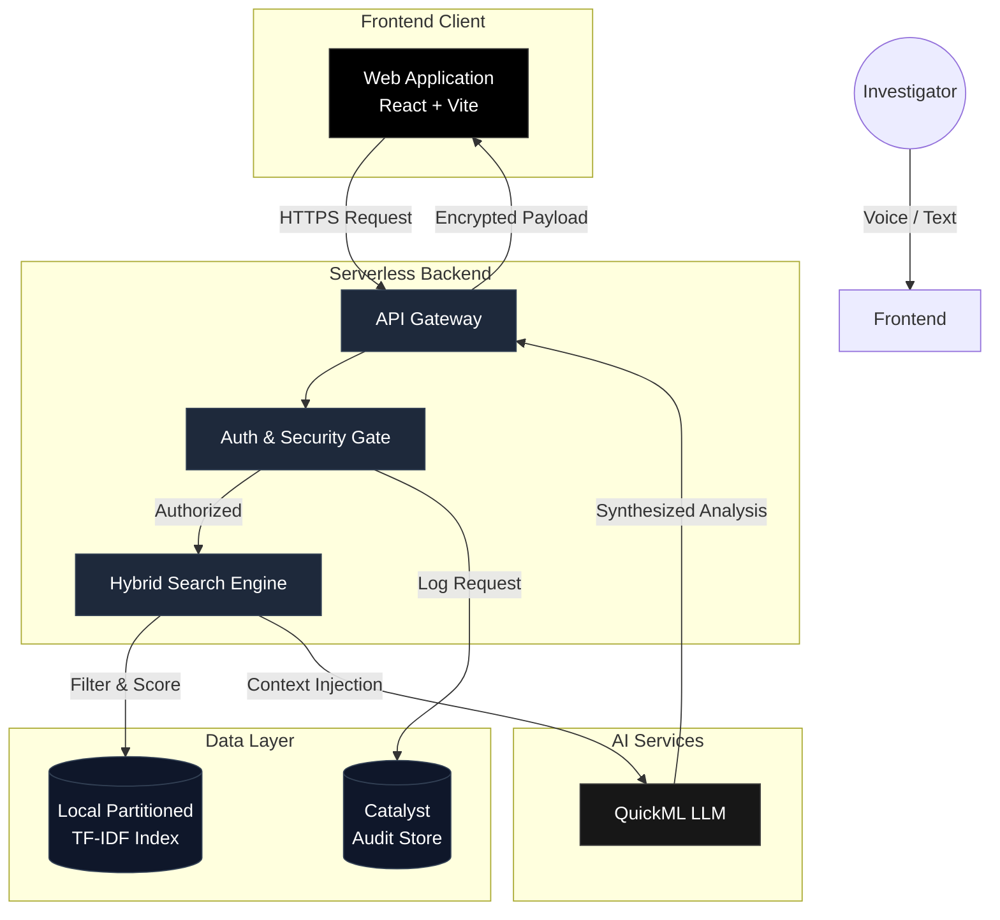
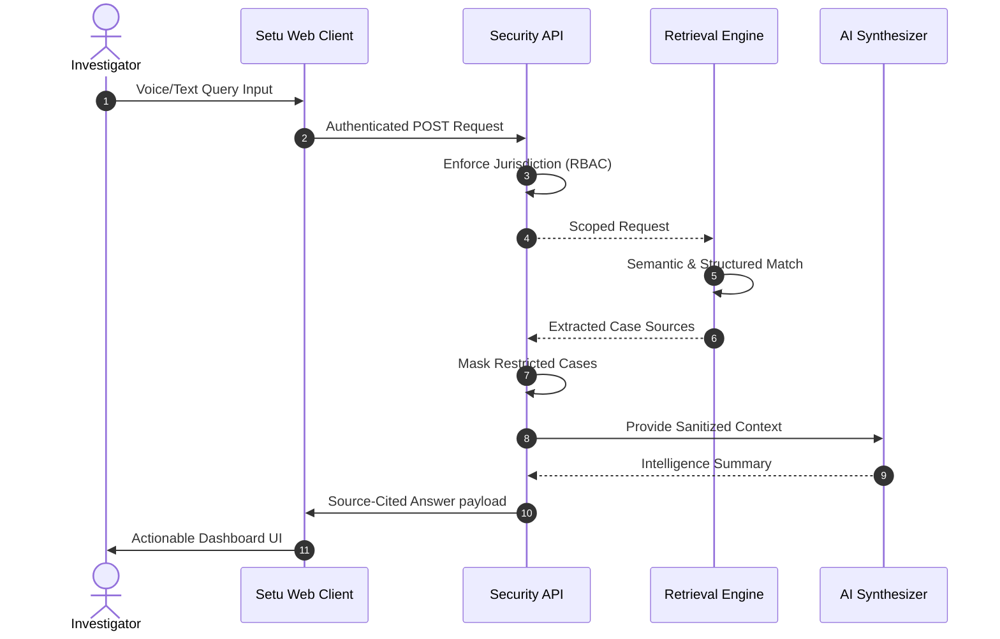

<div align="center">
  
  <br/><br/>
  <h1>Setu Intelligence Platform</h1>
  <p><b>Advanced Conversational AI & Analytics for the Karnataka State Police</b></p>

  <p>
    
    
    
    
  </p>
</div>

<br/>

## Overview

Setu is an enterprise-grade, bilingual (Kannada & English) conversational AI designed exclusively for law enforcement. It empowers investigators to query vast crime databases using natural language, providing source-cited intelligence, advanced network visualization, and proactive pattern recognition. 

Built natively on **Zoho Catalyst**, the platform ensures all intelligence is strictly grounded in case evidence.

<div align="center">
  
</div>

---

## Core Capabilities

- **Bilingual Conversational Interface**: Native support for English and Kannada via both text and voice.
- **Explainable RAG**: Retrieval-Augmented Generation provides deterministic answers backed by explicitly cited, clickable case sources.
- **Criminal Network Visualization**: Interactive D3.js node graphs identifying relationships between suspects, locations, and modus operandi.
- **Tamper-Evident Auditing**: Immutable hash-chained query logs ensure complete transparency.
- **Strict Role-Based Access Control**: Enforces jurisdiction boundaries automatically (e.g., Station Officer vs. State Analyst).
- **High-Performance Hybrid Search**: Proprietary District-Level Index Partitioning achieving sub-100ms retrieval latency at scale.

---

## System Architecture

The architecture utilizes a serverless event-driven design, leveraging Zoho Catalyst Advanced I/O functions for orchestration, hybrid semantic search, and LLM synthesis.



---

## User Flow



---

## Technical Stack

| Component | Technology | Purpose |
|---|---|---|
| **Frontend** | React, TypeScript, Vite, D3.js | High-performance, reactive user interface and data visualization. |
| **Backend** | Python 3.10+ | Orchestration, text processing, and security middleware. |
| **Infrastructure** | Zoho Catalyst | Serverless Advanced I/O, Data Store, and Edge Caching. |
| **AI/ML** | QuickML, TF-IDF, BM25 | Hybrid retrieval and generative summarization. |

---

## Installation & Deployment

**1. Repository Setup**
```bash
git clone https://github.com/Monolithic-Dev/Datathon-Hack.git
cd Datathon-Hack
```

**2. Catalyst CLI Initialization**
```bash
npm install -g zcatalyst-cli
catalyst login
catalyst init
```

**3. Dependency Management**
```bash
# Initialize client environment
cd client && npm install

# Initialize serverless functions
cd ../functions/setu_api && pip install -r requirements.txt --break-system-packages
```

**4. Local Development**
```bash
# Boot the Catalyst local server
catalyst serve

# Start the frontend dev server (in a separate terminal)
cd client && npm run dev
```

---

## Responsible AI Commitment

Setu is engineered with strict ethical guardrails. Predictive models and pattern recognition engines operate exclusively on **modus operandi and case-level evidence**. The system actively strips and prohibits filtering by demographic, religious, caste, or socio-economic indicators at the schema level.

<br/>
<div align="center">
  <p><i>Developed for the Karnataka State Police Datathon 2026</i></p>
</div>
