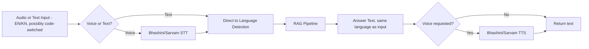
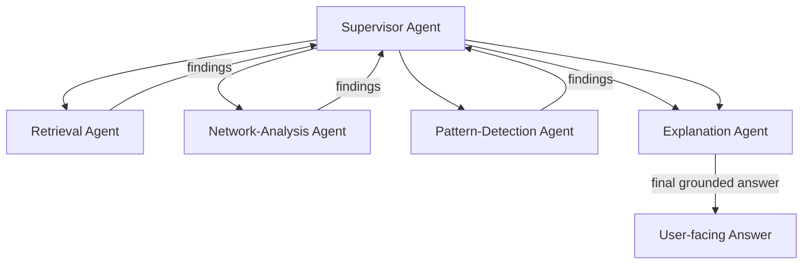
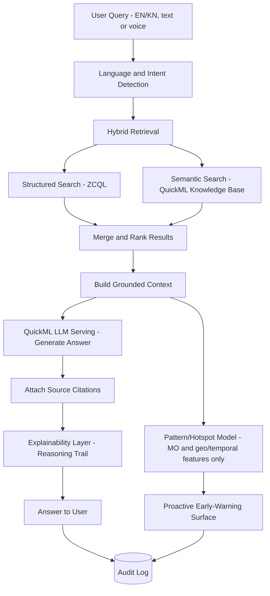

# AIArchitecture.md

**Phase 4 of 8 · Challenge 1: Intelligent Conversational AI for the KSP Crime Database**

---

## 1. RAG Pipeline

**Ingestion**
1. Synthetic case records (bilingual narrative text + structured fields) generated per `Database.md` schema.
2. Zia Named Entity Recognition extracts people, locations, weapons, and dates from free-text narratives to enrich structured fields.
3. Records are indexed two ways: structured fields into Data Store tables (queryable via ZCQL), and narrative text into QuickML's Knowledge Base for semantic retrieval.

**Retrieval (hybrid, per FR-3.1)**
- **Structured path**: ZCQL query filters by explicit fields the query mentions (case ID, date range, location, weapon type) — fast, exact, and auditable.
- **Semantic path**: QuickML Knowledge Base similarity search over narrative embeddings — catches relevant cases the officer describes in natural language without knowing the exact case ID or field values.
- Results from both paths are merged and re-ranked before being handed to generation. Neither path alone is sufficient: structured-only misses natural-language nuance; semantic-only misses precise filters like date ranges.

**Generation**
- QuickML LLM Serving (e.g., a Qwen 2.5-class instruct model, per Catalyst's current QuickML offering) generates the answer, prompted with the merged retrieved context.
- The prompt explicitly instructs the model to answer only from retrieved context and to say "not found" rather than fabricate, per FR-3.3.

**Grounding/Citation**
- Every generated answer carries the source record IDs it drew from (FR-3.2), surfaced to the user and written to the audit log in the same step — not as a post-hoc lookup.

**Grounding Verification** *(added Phase 7 review)*
- Prompting the model to answer only from context is necessary but not sufficient — it's a known-leaky control, since generative models can still produce plausible claims not actually entailed by what was retrieved. Before an answer is shown, a lightweight verification pass checks that each factual claim in the generated answer is actually supported by the cited source text (e.g., an entailment check, or a second, cheaper model call asking "is this claim supported by this source, yes/no"). An answer that fails verification is either regenerated once or returned as "not found" rather than shown — this is what actually enforces FR-3.3, not the prompt instruction alone.

---

## 2. Bilingual & Voice Pipeline

Code-switched input (Kannada and English mixed mid-sentence, which is how officers actually speak per `Research.md`) is handled by choosing an STT/TTS provider verified to support it (Sarvam AI explicitly markets this capability) rather than assuming a pure single-language pipeline will cope.

---

## 3. Explainable AI Pipeline

Every answer — conversational, network-graph, or predictive — carries a visible reasoning trail, per FR-6.1 and NFR-3:
1. Which records were retrieved (structured + semantic hits)
2. Why they were considered relevant (matched fields / similarity signal)
3. What the model generated from them
4. For predictive/pattern signals specifically: which case/MO features triggered the signal — explicitly never which demographic or socio-economic fields, since those aren't inputs to this pipeline at all (see §4)

This is designed as a first-class output of the pipeline, not a separate "explain" button bolted on afterward — because retrofitted explainability tends to describe what the system *might* have done, while pipeline-native explainability describes what it *actually* did.

---

## 4. Predictive Analytics & Early-Warning Model

Deliberately **classical ML, not an LLM**, for this component — it needs to be benchmarked with hard numbers (precision/recall/AUC) per template slide 12, which classical models support far more cleanly than generative output does.

- **Inputs (allowed)**: modus operandi (method, weapon, entry technique), time of day/week, location/geography, case-linkage signals (shared MO across cases), historical frequency by area.
- **Inputs (permanently excluded, per FR-5.2 and `HackathonAnalysis.md` §9)**: demographic fields, socio-economic proxies, caste/religion/community indicators, or any field that functions as a stand-in for identity rather than case evidence. This exclusion is enforced at the data-access layer (the Prediction Service's Data Store scope simply does not include those columns), not just by policy — so it can't be silently reintroduced by a future contributor who doesn't know the history here.
- **Method**: Zia AutoML or a lightweight clustering/frequency model over the built-in OLAP layer (e.g., grid-based or density-based clustering of case location+time+MO vectors) to surface hotspots and repeat-pattern clusters.
- **Output framing**: aggregate/geographic/temporal signals ("cluster of similar break-ins in this zone this month"), never an individual risk score attached to a named person (FR-5.3).

**Residual risk, stated honestly** *(added Phase 7 review)*: excluding demographic fields from the model's inputs mitigates the most direct form of bias, but doesn't fully solve it — location itself can function as a demographic proxy if certain areas have been historically over-policed for reasons unrelated to actual crime rates, since that history is baked into the training data regardless of which columns the model reads. Input-side exclusion (this section) is necessary but not sufficient; it needs to be paired with output-side monitoring — periodically checking whether hotspot flags disproportionately concentrate in specific areas relative to independent crime indicators, not just verifying the inputs look clean. Tracked as an ongoing item in `MonitoringStrategy.md`, not something a schema decision alone closes out.

---

## 5. Multi-Agent Architecture: Now vs. Refinement Window

**Now (Concept B, prototype submission)**: a single orchestrator (the Conversation Service) calling discrete, non-agentic "skills" — retrieval, generation, network-graph building, prediction. Simpler, more testable, and enough to satisfy every MVP requirement in `FeaturePrioritization.md`.

**Refinement window (Concept C upgrade path)**: the orchestrator becomes a true supervisor agent coordinating specialized sub-agents that can reason and hand off independently:

Building the skills as clean, separable services now (§1 above) is exactly what makes this upgrade a reorganization of existing components in August rather than a rewrite — the interfaces are designed for it from day one, even though the orchestration logic between them stays simple for the prototype round.

---

## 6. AI Workflow (end-to-end)

---

## 7. Model Evaluation Framework

| Metric | What it measures | How measured |
|---|---|---|
| Retrieval precision@k | Are the right records being found | Held-out synthetic test set with known correct answers |
| Bilingual accuracy parity | Does Kannada perform as well as English | Same eval set, run in both languages, compared |
| Code-switch robustness | Does mixed Kannada-English input work | A dedicated code-switched subset of the eval set |
| Hallucination rate | Does the system ever answer without grounding | Manual review of a sample of answers against their cited sources |
| Latency | Is it fast enough for mid-investigation use | Measured against the target set once Catalyst QuickML benchmarks are available |
| Hotspot/pattern precision-recall | Is the prediction model's output meaningful | Standard classical-ML metrics against synthetic labeled clusters |

This eval set and protocol is a **Week 1 deliverable**, per `Roadmap.md` — not something assembled the week before submission.

---

*Next: `Database.md`, `APISpec.md`, `Security.md`, `Deployment.md`, `UX.md`.*
