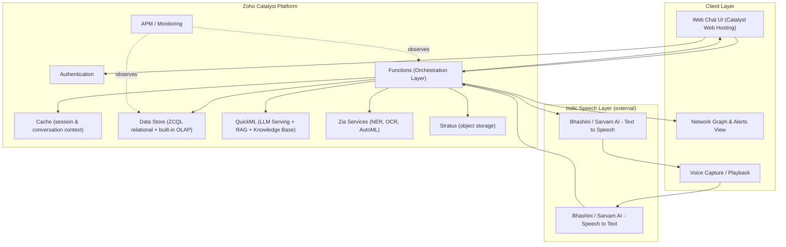
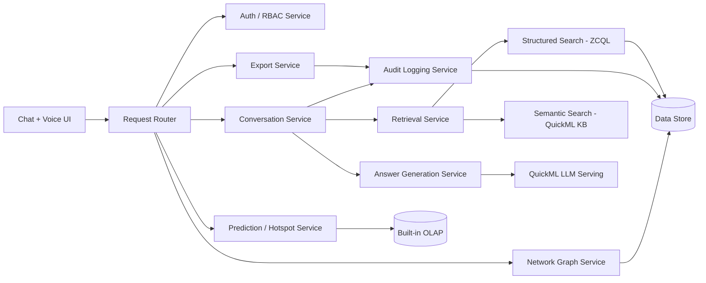

# Architecture.md

**Phase 4 of 8 · Challenge 1: Intelligent Conversational AI for the KSP Crime Database**

---

## 1. Architectural Approach

Cloud-native, serverless, built entirely on Zoho Catalyst components rather than a custom-provisioned backend — this is both the mandated deployment constraint and, now that we've verified Catalyst's actual capabilities, a genuinely good fit: Catalyst's Data Store is a real relational database with native table-level access scopes (not just a key-value store), it ships a built-in OLAP engine for analytical queries, and its Functions support retry/fallback orchestration out of the box — all of which map directly onto our RBAC, hotspot-analytics, and reliability requirements without bolting on extra infrastructure.

---

## 2. High-Level Architecture

---

## 3. Component Diagram (logical services, inside the Functions layer)

---

## 4. Component Responsibilities

| Component | Responsibility | Catalyst Service |
|---|---|---|
| Request Router | Entry point, dispatches to the right service | Functions (Advanced I/O) |
| Auth/RBAC Service | Authenticates user, resolves role, enforces scope | Authentication + Data Store table scopes |
| Conversation Service | Manages multi-turn context, orchestrates retrieval + generation | Functions + Cache |
| Retrieval Service | Hybrid search: structured filters + semantic search | ZCQL + QuickML Knowledge Base |
| Answer Generation Service | Produces grounded, cited answers | QuickML LLM Serving |
| Network Graph Service | Builds entity-relationship graphs for visualization | Data Store + Zia NER |
| Prediction/Hotspot Service | Surfaces aggregate pattern/hotspot signals | Built-in OLAP + Zia AutoML |
| Audit Logging Service | Immutable record of every query/answer/source | Data Store |
| Export Service | Generates PDF of a conversation + audit trail | Functions + Stratus |

---

## 5. Why Not a Separate Vector Database

Given QuickML's Knowledge Base already provides document ingestion and retrieval for RAG, and Data Store's built-in Search covers indexed-column lookup, a bolt-on external vector database (e.g., Pinecone/Weaviate) isn't needed for this scope — it would add infrastructure and a second data-residency surface without a clear benefit, and would dilute the "built natively on Catalyst" story that matters for template slide 9. Revisit only if QuickML's Knowledge Base proves insufficient for the retrieval quality bar during Phase 4/8 testing.

---

*Next: `Design.md` (patterns, layering, sequence diagram), `AIArchitecture.md` (RAG/prediction/XAI detail).*
