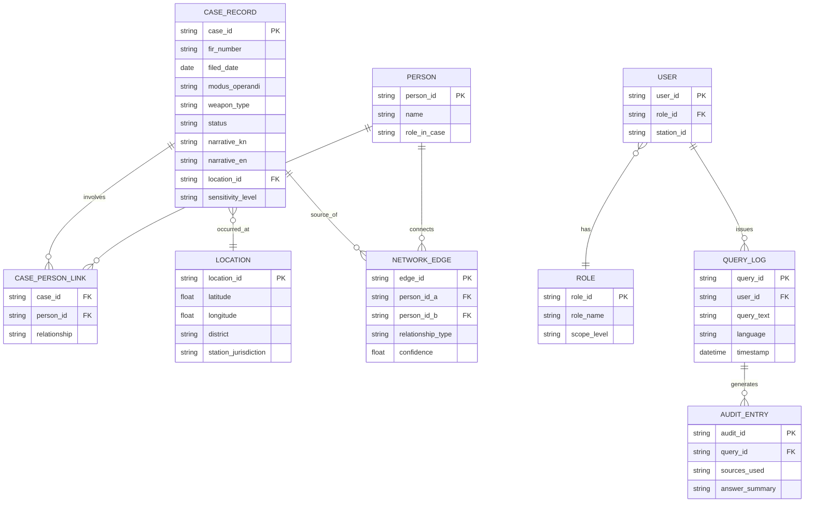

# Database.md

**Phase 4 of 8 · Challenge 1: Intelligent Conversational AI for the KSP Crime Database**

---

## 1. Storage Split

- **Catalyst Data Store** (verified: a genuine relational database with ZCQL, not just key-value) — holds all structured records: cases, persons, locations, network edges, users/roles, query logs, audit entries. Table-level scopes/permissions enforce RBAC natively at the database layer.
- **Catalyst QuickML Knowledge Base** — holds bilingual narrative text for semantic retrieval; not a relational store, referenced by `case_id` back to the Data Store record.
- **Built-in OLAP** (part of Data Store) — used for aggregate/analytical queries powering the Prediction/Hotspot Service, without needing a separate warehouse.
- **Stratus** — object storage for any exported PDFs and, if scanned-document ingestion is added later, source images/PDFs before OCR.

---

## 2. Entity-Relationship Diagram

---

## 3. Deliberate Field Exclusions

Per `AIArchitecture.md` §4 and `HackathonAnalysis.md` §9: the schema **does not include** demographic, caste, religion, or socio-economic classification fields anywhere they could feed the Prediction Service. `PERSON` carries only what's operationally necessary (name, role in the case) — not attributes that could function as identity-profiling inputs. This is a schema-level decision, not just an application-level filter, so it can't be quietly worked around later.

---

## 4. Table-Level Scopes (RBAC at the data layer)

| Table | Station Officer | SCRB Analyst | District SP | System Admin |
|---|:---:|:---:|:---:|:---:|
| CASE_RECORD | Own station's cases + read-linked | All (read) | District-scoped (read) | All |
| PERSON | Scoped via case access | All (read) | District-scoped | All |
| NETWORK_EDGE | Scoped via case access | All (read) | District-scoped | All |
| QUERY_LOG / AUDIT_ENTRY | Own queries only | All (read, for oversight) | District-scoped | All |
| ROLE / USER | No access | No access | No access | Full |

Implemented using Catalyst Data Store's native table scopes and permissions, combined with a `station_id`/`district_id` filter applied server-side in the Retrieval Service — never left to client-side filtering.

**Case-level sensitivity** *(added Phase 7 review)*: role-based scope alone isn't sufficient — a case involving a minor (POCSO-related) or otherwise flagged sensitive needs restriction beyond what a requesting officer's general role would grant. `CASE_RECORD.sensitivity_level` (`standard` / `restricted`) is checked in addition to, not instead of, the role-scope table above: a `restricted` case is only visible to roles explicitly cleared for it, regardless of station/district match — a second, independent access gate (FR-7.3).

---

## 5. Synthetic Data Strategy

Since real SCRB data won't be released (`PRD.md` §8):
- Generate a bilingual (Kannada narrative + English narrative) synthetic case corpus with realistic but fictional case details, modeled on publicly known FIR structure and CCTNS field conventions rather than any real case.
- Vary modus operandi, location, and timing realistically enough to produce genuine clusters for the Prediction Service to find — otherwise the hotspot demo has nothing real to detect.
- Explicitly exclude any demographic/socio-economic fields from generation entirely (§3) — this also simplifies the synthetic-data task, since one whole sensitive category doesn't need to be modeled at all.
- Document the generation methodology clearly in the GitHub README, since judges and future evaluators will want to know the data is synthetic and how it was built — transparency here is a credibility asset, not a weakness to hide.

---

*Next: `APISpec.md`, `Security.md`, `Deployment.md`, `UX.md`.*
