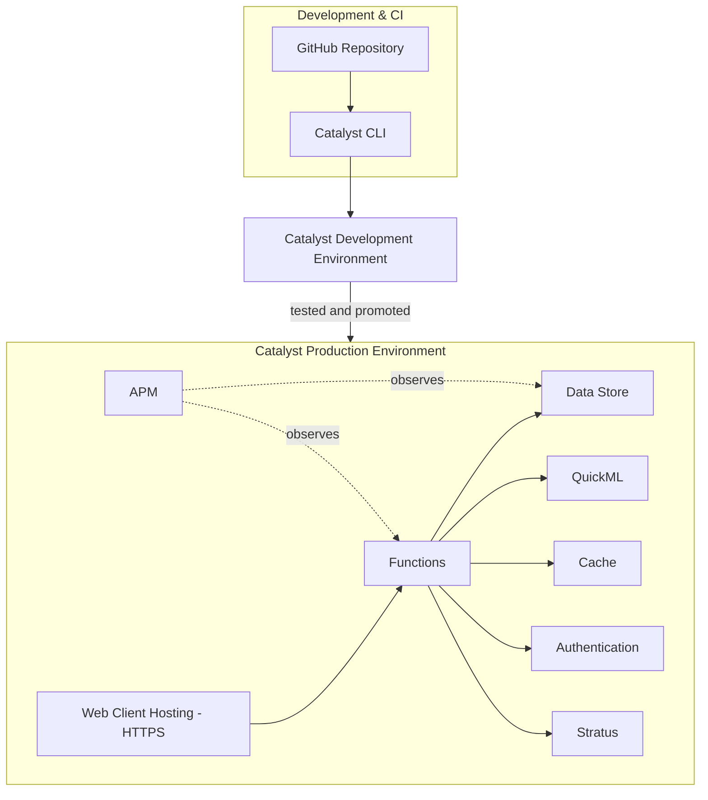

# Deployment.md

**Phase 4 of 8 · Challenge 1: Intelligent Conversational AI for the KSP Crime Database**

---

## 1. Catalyst Services Used (for template slide 9)

| Service | Purpose |
|---|---|
| Functions | Core orchestration/business logic (Advanced I/O) |
| Data Store (+ ZCQL + built-in OLAP) | Structured records, RBAC scopes, analytics for hotspot detection |
| QuickML (LLM Serving + RAG + Knowledge Base) | Conversational AI core |
| Zia Services (NER, OCR, AutoML) | Entity extraction from narratives, optional scanned-document OCR, classical prediction modeling |
| Cache | Conversation/session context |
| Authentication | User login, RBAC token issuance |
| Web Client Hosting | Frontend hosting over HTTPS |
| Stratus | Object storage (exported PDFs); explicitly used **instead of** the deprecated File Store |
| APM | Function performance monitoring |
| Automation Testing | API test execution and failure diagnostics |

Deliberately **not used**: Event Listeners, File Store, Cron — all on Catalyst's deprecation path toward end-of-life 30 Apr 2026 (`memory.md`). Building on them now would mean migrating mid-project for no benefit.

---

## 2. Deployment Architecture

---

## 3. CI/CD Approach (right-sized for a 20-day build)

- Single GitHub repo, feature branches per workstream (AI/ML, backend, frontend), merged to `main` after review by at least one other team member.
- Deploy to Catalyst's Development environment continuously; promote to Production only after the Week 3 integration pass (`Roadmap.md`).
- No separate staging environment for this timeline — Development environment doubles as the pre-production testing ground, with the internal 24–25 Jul buffer day used specifically for a full run-through on the Production deployment before the actual submission.

## 4. Reliability Practices

- Automation Testing (Catalyst's built-in API test/failure-diagnostics feature) run against every deployed version, not just locally.
- Fallback paths (`Design.md` §3) explicitly tested by deliberately disabling a dependency (e.g., simulating a Bhashini timeout) before submission — the Odisha precedent is a reminder that "it worked when we tried it" isn't the same as "it works under failure."
- APM dashboards checked before the Grand Finale specifically, not only during initial build.

---

*Next: `UX.md`.*
