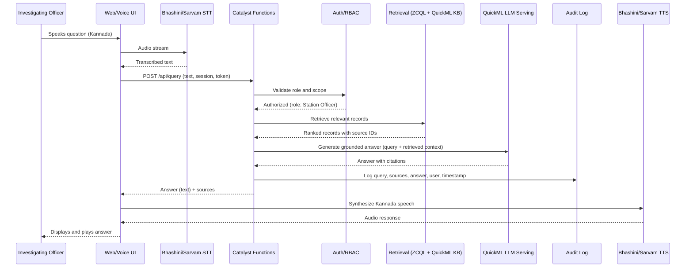

# Design.md

**Phase 4 of 8 · Challenge 1: Intelligent Conversational AI for the KSP Crime Database**

*Note: this document describes the target architecture. See `Datathon_Implemented_Features.md` and `new/06_IMPLEMENTATION_GAPS_TRACKER.md` for what's implemented in the current submission.*

---

## 1. Layering (Clean Architecture, mapped onto serverless)

| Layer | Contents | Catalyst mapping |
|---|---|---|
| Presentation | Chat UI, voice capture, network graph rendering | Web Client Hosting |
| Application / Orchestration | Conversation flow, retrieval coordination, workflow branching/retries | Functions (using native workflow orchestration: branching, retries, fallbacks) |
| Domain | Case, Person, Location, Network Edge, Role, Audit Entry — the actual business rules (e.g., "profiling signals must derive from MO features, not demographic fields") | Plain domain logic inside Functions, independent of any specific Catalyst API |
| Infrastructure | Data Store/ZCQL, QuickML, Zia, Cache, Stratus, external Bhashini/Sarvam calls | Catalyst services + external adapters |

Keeping the domain layer's business rules (especially the responsible-AI constraint on FA5) independent of infrastructure code means that rule is enforced once, in one place, rather than re-implemented in every service that touches prediction — reducing the risk of it being silently bypassed later.

---

## 2. Bounded Contexts (light DDD)

- **Conversation Context** — turn-taking, language handling, context memory
- **Identity & Access Context** — users, roles, scopes
- **Crime-Data Context** — cases, persons, locations, the factual record
- **Network/Graph Context** — relationships and link analysis
- **Analytics/Prediction Context** — aggregate pattern and hotspot detection
- **Audit Context** — the immutable record of what the system did and why

Each context maps to one or two of the logical services in `Architecture.md` §3, keeping the responsible-AI boundary (Analytics/Prediction Context never touching demographic fields) enforceable at the context boundary, not just by convention.

---

## 3. Key Design Patterns

- **Adapter pattern** for the Indic speech layer — Bhashini and Sarvam AI sit behind one internal `SpeechProvider` interface, so either can be swapped or run in parallel for redundancy without touching the Conversation Service.
- **Strategy pattern** for retrieval — structured (ZCQL) and semantic (QuickML Knowledge Base) retrieval strategies are combined and re-weighted without changing the calling code.
- **Fallback/circuit-breaker** — Catalyst Functions' native branching/retry/fallback support is used so that, for example, a Bhashini timeout falls back to Sarvam (or to text-only mode) rather than failing the whole request. Directly answers the reliability concern raised by the Odisha precedent (`CompetitorAnalysis.md` §5).

---

## 4. Sequence Diagram — "Officer asks a Kannada voice question about a suspect"

---

*Next: `AIArchitecture.md` — RAG pipeline, bilingual handling, explainability, prediction model, and the multi-agent growth path in detail.*
