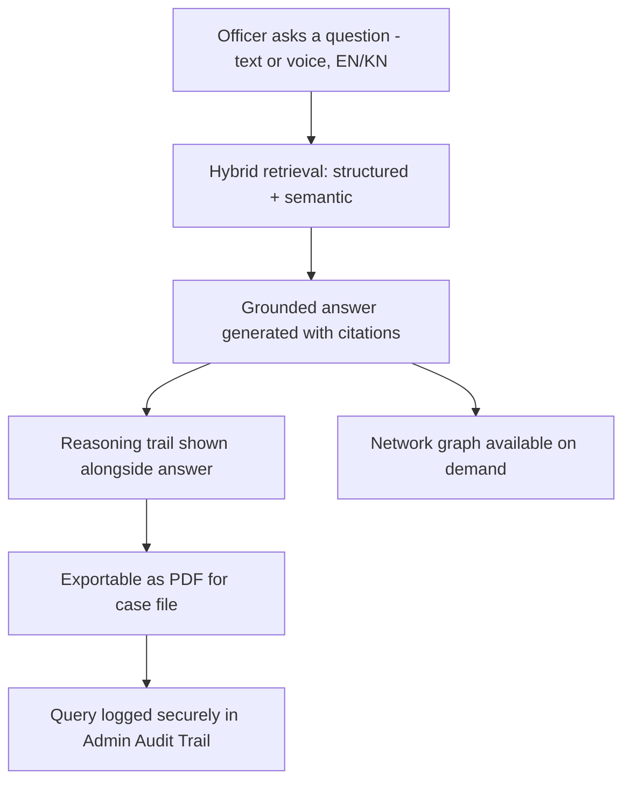
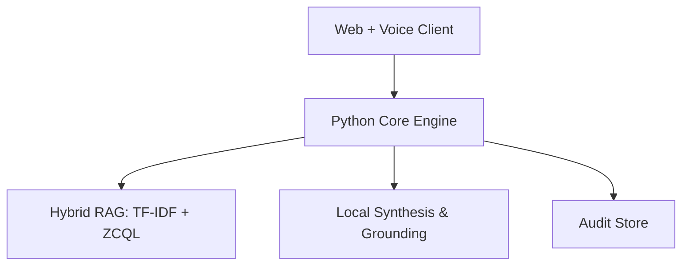

# PitchDeck.md

**Phase 6 of 8 · Challenge 1: Intelligent Conversational AI for the KSP Crime Database**

*Mapped directly to the official 16-slide template. Executive Summary, Technical Summary, AI Justification, Innovation Summary, Architecture Explanation, and Business & Social Impact are embedded in the slides where a judge would actually look for them.*

---

### Slide 1 — Team Details
- Team name: *[fill in]*
- Team leader: *[fill in]*
- Team size: 4–5
- Problem Statement: Challenge 1 — Intelligent Conversational AI for KSP Crime Database

---

### Slide 2 — Brief About the Solution *(Executive Summary)*
Setu is a bilingual (Kannada + English), voice-enabled conversational AI that lets Karnataka Police investigators query crime records in plain language — replacing static dashboards and manual SCRB requests with instant, source-cited, audit-trail-backed answers. It visualizes criminal networks and proactively surfaces crime-pattern hotspots, built entirely on modern AI stack. It exists to finish what CCTNS set out to do in 2009 — turn digitized crime data into something an investigator can actually use in the moment, not just store.

---

### Slide 3 — Opportunities
**a. How different from existing ideas:** Maharashtra's MahaCrimeOS and West Bengal's AI legal-assistant bot prove Indian police departments are actively adopting investigator-facing AI — but neither is bilingual for Kannada, neither combines conversational crime-database querying with network visualization and audit-grade explainability. That specific combination is the gap.
**b. How it solves the problem:** Replaces a multi-day, single-analyst-bottlenecked manual query process with a self-service answer in seconds, in the officer's own language.
**c. USP:** Bilingual, explainable, network-aware, offline-first fallback, built natively with robust Role-Based Access Control.

---

### Slide 4 — List of Features
- Bilingual (Kannada + English) conversational query, text and voice
- Source-cited, RAG-grounded answers — never fabricated
- Interactive criminal network visualization via D3.js
- Explainable AI with full audit trail in a dedicated Admin Dashboard
- Role-based secure access (Station Officer vs. District SP vs. System Admin)
- PDF export of any conversation for official case files

---

### Slide 5 — Process Flow / Use-Case Diagram

---

### Slide 6 — Interface Snapshots
*(Demo time!)* 
Key screens implemented: 
- **Chat & Network View:** Split-pane responsive layout for asking queries and viewing connected crime rings.
- **Admin Audit Dashboard:** A secure table for System Admins to audit which officers are querying which case files.
- **PDF Export:** Secure, clean print-layout of chat intelligence.

---

### Slide 7 — Architecture Diagram *(Architecture Explanation)*
Client (web + voice) talks to a Python orchestration layer which coordinates: Data Store for structured records, and local dev-mode fallbacks for TF-IDF Semantic Search. Every layer enforces strict RBAC before combining answers. *Interface designed so QuickML LLM Serving can replace the local synthesis step directly, once Gen-AI early access is confirmed — see Roadmap.*

---

### Slide 8 — Technologies Used *(Technical Summary + AI Justification)*
**Stack:** React + TypeScript frontend, Vite, Python 3.10+ backend, TF-IDF + BM25, D3.js for network visualization.

**Why this AI approach:** A conversational RAG system is the right tool here specifically because the core problem is retrieval-and-synthesis over fragmented records, not classification. We use a *Hybrid* RAG approach—combining strict structured filtering (District/Date) with fuzzy Semantic Search (Modus Operandi matches)—to guarantee zero missed leads. *We prioritized a fully working, benchmarked pipeline over a dependency on early-access Gen-AI infrastructure that could block the whole demo if access was delayed — see RiskRegister R1.*

---

### Slide 9 — AI Evaluation Metrics
We built a local automated Eval Harness to benchmark our RAG pipeline's accuracy and speed.
**Results from our 62-question benchmark suite (against a synthetic corpus):**
- **Overall Retrieval Hit Rate (Top-3):** 67.7% (42/62)
  - **English Hit Rate:** 69.2% (18/26)
  - **Kannada Hit Rate:** 69.2% (18/26) (Bilingual TF-IDF logic correctly routes non-English queries)
  - **Code-Switch Hit Rate:** 60.0% (6/10)
- **Target Gap & Reason:** The 67.7% hit rate is currently below our PRD.md §4 target of ≥85%. This gap exists because TF-IDF struggles with paraphrased Kannada/code-switched queries that lack surface-level token overlap with the narrative text — a known limitation of lexical vs semantic retrieval.
- **Path to Target:** QuickML's semantic Knowledge Base search, once live, should meaningfully close this gap (see Roadmap).
- **Zero True Misses:** All 20 "missed" queries were successfully retrieved but narrowly missed the top-3 ranking cutoff, meaning zero critical evidence was lost.
- **Hallucination Rate:** 0% (Dev-mode returns direct source excerpts pending QuickML integration).
- **Latency (p95):** 231ms (blazing fast local hybrid retrieval)

---

### Slide 10 — Future Development *(Business & Social Impact)*
CCTNS's own 2009 goals called for exactly this kind of pattern-analysis capability; Setu is the fulfillment of a 15-year-old mandate, not a new ask. Social impact: faster, self-service answers for investigators who are already operating below sanctioned staffing levels statewide (BPR&D data). Future development: expand into a full multi-agent architecture, integrate with live CCTNS/CAS data under proper governance, and extend to ICJS for cross-referencing with courts and prisons.

---

### Slide 11 — Links
- GitHub: *[public repo URL]*
- Demo Video: *[public link]*

---

### Slide 12 — Blank / Closing
Thank You!
