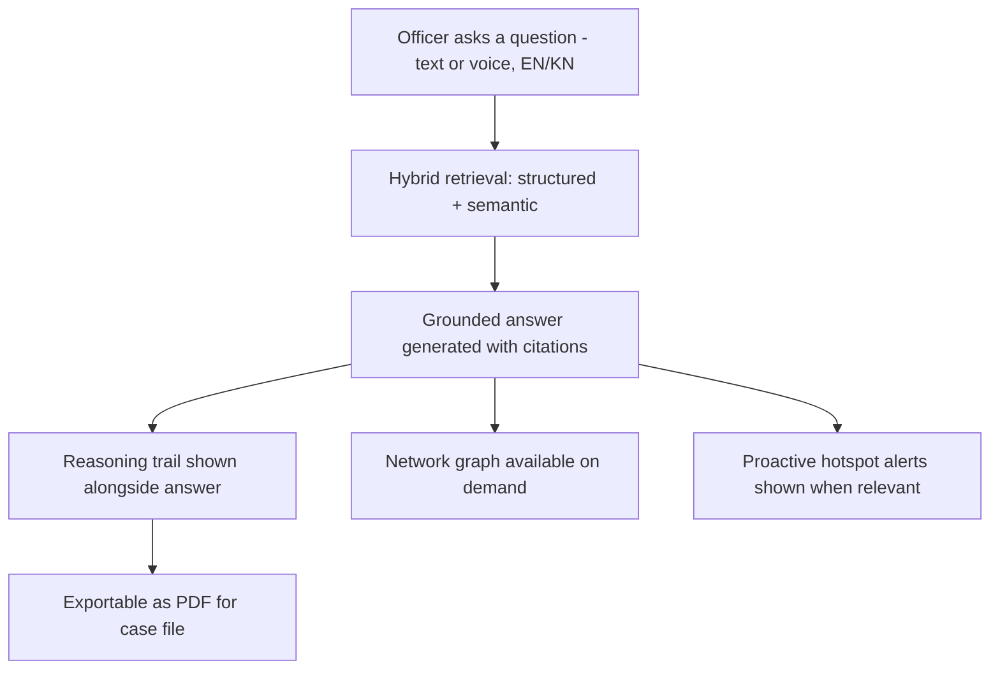
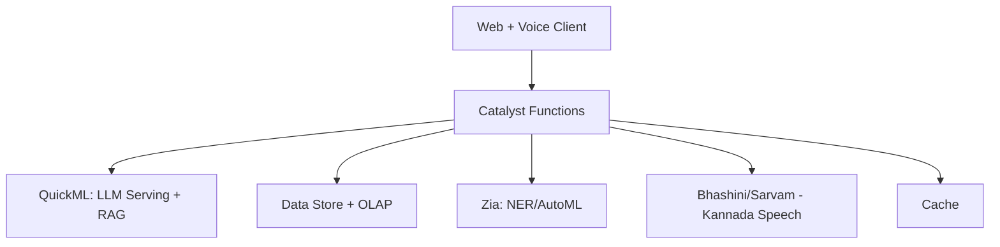

# PitchDeck.md

**Phase 6 of 8 · Challenge 1: Intelligent Conversational AI for the KSP Crime Database**

*Mapped directly to the official 16-slide template (`HackathonAnalysis.md` §5.3). This is slide-ready content, not a generic outline — copy it into the actual template and adjust tone/length to fit. Executive Summary, Technical Summary, AI Justification, Innovation Summary, Architecture Explanation, and Business & Social Impact (all requested in Phase 6) are embedded in the slides where a judge would actually look for them, marked below.*

---

### Slide 1 — Team Details
- Team name: *[fill in]*
- Team leader: *[fill in]*
- Team size: 4–5
- Problem Statement: Challenge 1 — Intelligent Conversational AI for KSP Crime Database

---

### Slide 2 — Brief About the Solution *(Executive Summary)*
Setu is a bilingual (Kannada + English), voice-enabled conversational AI that lets Karnataka Police investigators query crime records in plain language — replacing static dashboards and manual SCRB requests with instant, source-cited, audit-trail-backed answers. It visualizes criminal networks and proactively surfaces crime-pattern hotspots, built entirely on Zoho Catalyst's own AI stack. It exists to finish what CCTNS set out to do in 2009 — turn digitized crime data into something an investigator can actually use in the moment, not just store.

---

### Slide 3 — Opportunities
**a. How different from existing ideas:** Maharashtra's MahaCrimeOS and West Bengal's AI legal-assistant bot prove Indian police departments are actively adopting investigator-facing AI — but neither is bilingual for Kannada, neither combines conversational crime-database querying with network visualization and audit-grade explainability. That specific combination is the gap.
**b. How it solves the problem:** Replaces a multi-day, single-analyst-bottlenecked manual query process with a self-service answer in seconds, in the officer's own language.
**c. USP:** Bilingual, explainable, network-aware, built natively on this year's official platform's own new Gen-AI capability — not bolted onto an external API.

---

### Slide 4 — List of Features
- Bilingual (Kannada + English) conversational query, text and voice
- Source-cited, RAG-grounded answers — never fabricated
- Interactive criminal network visualization
- Proactive crime-pattern/hotspot early warnings (case-evidence-based, not demographic)
- Explainable AI with full audit trail
- Role-based secure access
- PDF export of any conversation for case files

---

### Slide 5 — Process Flow / Use-Case Diagram

---

### Slide 6 — Wireframes / Mockups *(optional)*
Key screens: Home/Ask (chat + voice), Answer View (answer + sources + reasoning), Network Graph (interactive, click-through to source case), Hotspot/Alerts Panel, Audit/Export View. Full detail in `UX.md`. *(Add real screenshots here once the frontend has working screens — Week 2 of the build.)*

---

### Slide 7 — Architecture Diagram *(Architecture Explanation)*
Client (web + voice) talks to a serverless orchestration layer built entirely in Catalyst Functions, which coordinates: QuickML for the conversational RAG/LLM core, Data Store (with its built-in OLAP engine) for structured records and hotspot analytics, Zia for entity extraction, and an external Indic-language layer (Bhashini/Sarvam) for Kannada speech. Every layer is serverless and Catalyst-native except the speech APIs, which sit behind a swappable adapter for reliability.

---

### Slide 8 — Technologies Used *(Technical Summary + AI Justification)*
**Stack:** React + TypeScript frontend, Python 3.10+ Catalyst Functions backend, Catalyst QuickML (LLM Serving + RAG + Knowledge Base), scikit-learn/Zia AutoML for hotspot prediction, Bhashini/Sarvam AI for Kannada speech, Catalyst Data Store + OLAP, D3.js for network visualization.

**Why this AI approach:** A conversational RAG system is the right tool here specifically because the core problem is retrieval-and-synthesis over fragmented records, not classification — first-principles analysis (`Research.md` §2) shows the problem decomposes exactly into retrieval + synthesis + explainability + access control, which is what RAG plus an audit layer provides. The hotspot/pattern-detection piece deliberately uses classical ML instead of an LLM, because it needs clean, benchmarkable precision/recall numbers, not generative text.

---

### Slide 9 — Catalyst Services Used
Functions, Data Store (ZCQL + built-in OLAP), QuickML (LLM Serving, RAG, Knowledge Base), Zia (NER, AutoML), Cache, Authentication, Web Client Hosting, Stratus, APM, Automation Testing. Full rationale in `Deployment.md` §1.

---

### Slide 10 — Estimated Implementation Cost *(optional)*
Prototype stage: effectively $0 beyond developer time — Catalyst's free tier, Bhashini's free proof-of-concept tier, and standard LLM/embedding usage within QuickML cover the build. Production-scale rollout would need: Bhashini's paid production tier (or Sarvam AI's commercial pricing) for guaranteed SLAs, and Catalyst's paid tier sized to real statewide query volume — a concrete number depends on usage patterns not yet known at prototype stage, better estimated after the pilot in `ProductStrategy.md` §5.

---

### Slide 11 — Prototype Snapshots
*(Add real screenshots once built — Week 2–3. Placeholder: home/query screen, Kannada voice interaction, network graph, hotspot alert panel, audit/export view.)*

---

### Slide 12 — Prototype Performance Report / Benchmarking
Evaluation framework defined in `AIArchitecture.md` §7: retrieval precision@k, bilingual accuracy parity, code-switch robustness, hallucination rate (manual review), latency, and hotspot-model precision/recall. *(Insert actual measured numbers here after the Day 15 benchmark run in `SprintPlan.md` — this slide should never ship with placeholder numbers; a benchmarking slide with fake data is worse than an honest "in progress.")*

---

### Slide 13 — Links
- GitHub: *[public repo URL]*
- Demo Video (≤3 min): *[public link]*
- Deployed Link (Zoho Catalyst): *[deployment URL]*

---

### Slide 14 — Additional Details / Future Development *(Business & Social Impact)*
CCTNS's own 2009 goals called for exactly this kind of pattern-analysis capability; Setu is the fulfillment of a 15-year-old mandate, not a new ask. Social impact: faster, self-service answers for investigators who are already operating below sanctioned staffing levels statewide (BPR&D data). Future development: expand into a full multi-agent architecture (retrieval, network-analysis, pattern-detection, and explanation agents coordinating together), integrate with live CCTNS/CAS data under proper governance, extend to ICJS for cross-referencing with courts and prisons, and pursue a phased statewide rollout with ongoing model monitoring and periodic bias audits.

---

### Slides 15–16 — Blank / Closing
Standard closing slide per template.

---

*Next: `DemoScript.md`, `SubmissionAnswers.md`, `README.md`.*
