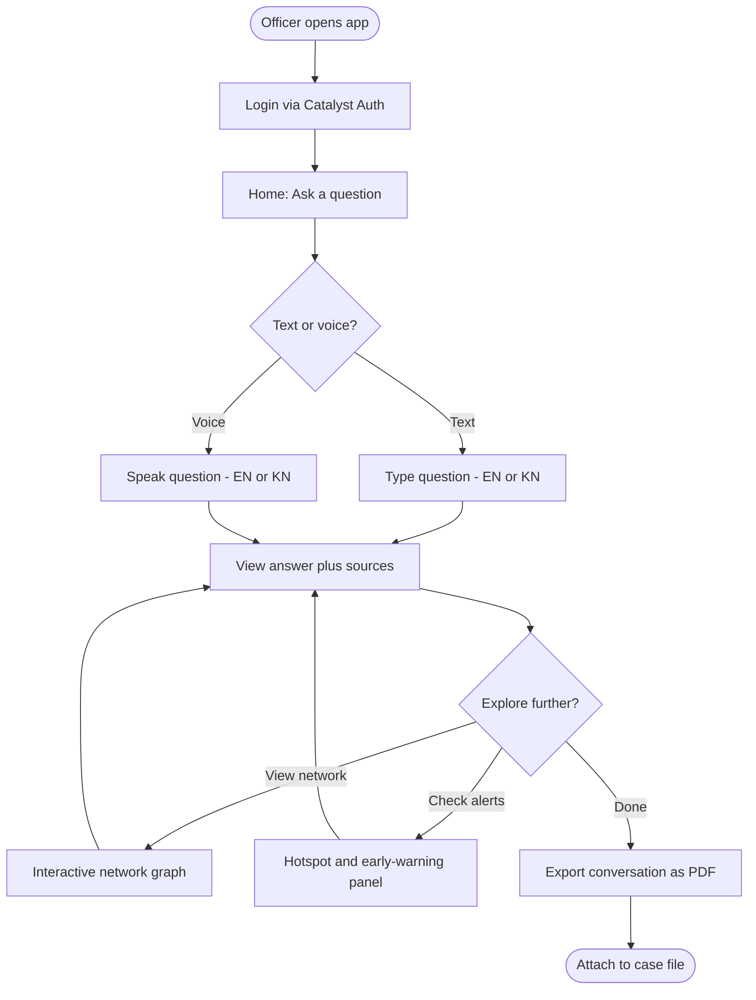

# UX.md

**Phase 4 of 8 · Challenge 1: Intelligent Conversational AI for the KSP Crime Database**

---

## 1. Design Principles

- **Voice is a first-class input, not a bonus feature** — many officers will find speaking faster and more natural than typing, especially in Kannada.
- **Plain language over jargon** — no "confidence score: 0.87" without a plain-language equivalent alongside it (NFR-8).
- **Explainability is visible by default**, not hidden behind an "advanced" toggle — sources and reasoning sit next to the answer, always.
- **Bilingual is symmetric** — English and Kannada get the same visual treatment, not an English-primary UI with Kannada as an afterthought toggle.
- **The network graph and alerts panel are exploratory, not just illustrative** — officers can click through to source records, not just look at a picture.

---

## 2. Key Screens

| Screen | Purpose |
|---|---|
| Login | Catalyst Authentication; role resolved immediately after |
| Home / Ask | Primary chat interface — text or voice input, language auto-detected or selected |
| Answer View | Answer text, source citations, reasoning trail, "export" and "ask a follow-up" actions, and a lightweight "was this helpful?" flag *(added Phase 7 review — FR-10.1)* |
| Network Graph | Interactive entity-relationship graph, expandable nodes, click-through to source case |
| Hotspot/Alerts Panel | Proactive pattern signals for the user's scope (station/district), each with its own reasoning trail |
| Audit/Export View | (SCRB Analyst / District SP / Admin) full audit log access; PDF export of any conversation |
| Connectivity State *(added Phase 7 review — NFR-10)* | A visible "reconnecting…" state when the network is poor, with the in-flight query queued and retried automatically rather than silently lost — not full offline mode, but never a silent failure either |

---

## 3. User Flow

---

## 4. Accessibility Notes

- Voice-first flow tested with officers who have lower digital literacy in mind, not just power users.
- Font/contrast choices should support quick scanning in potentially low-light field conditions, not just a well-lit office demo — worth testing under realistic viewing conditions ahead of the Grand Finale, in the same spirit as the reliability testing in `Deployment.md` §4.

---

*Phase 4 complete. Next (on your approval): Phase 5 — Engineering Planning (`FolderStructure.md`, `TechStack.md`, `CodingStandards.md`, `SprintPlan.md`, `TestingStrategy.md`, `DeploymentStrategy.md`, `MonitoringStrategy.md`, `RiskRegister.md`), sized for your 4–5 person team and 20-day window as flagged from Phase 1 onward.*
